<div align="center">

<!-- ═══════════════════════════════════════════════════ -->
<!--    HERO BANNER · drop pulse-banner.svg in /assets    -->
<!-- ═══════════════════════════════════════════════════ -->



<!-- ═══════════════════════════════════════════════════ -->
<!--    TYPING ANIMATION                                  -->
<!-- ═══════════════════════════════════════════════════ -->

<a href="https://pulse-opal-omega.vercel.app/">
  
</a>

<br/>

<!-- ═══════════════════════════════════════════════════ -->
<!--    BADGES                                            -->
<!-- ═══════════════════════════════════════════════════ -->


<br/>

[<kbd> <br/> &nbsp;&nbsp;**Live Demo**&nbsp;&nbsp; <br/> </kbd>](https://pulse-opal-omega.vercel.app/)
&nbsp;
[<kbd> <br/> &nbsp;&nbsp;**API Docs**&nbsp;&nbsp; <br/> </kbd>](https://pulse-9t12.onrender.com)
&nbsp;
[<kbd> <br/> &nbsp;&nbsp;**Architecture**&nbsp;&nbsp; <br/> </kbd>](#-architecture)

<br/>


</div>

## ▌ What is Pulse?

> Pulse turns a global Spotify streams dataset into a **Bloomberg-terminal-style analytics dashboard**. Momentum and velocity metrics in real time, breakout-track discovery, artist-dominance maps, and a natural-language *market vibe* summary — all wrapped in a Cyber-Noir aesthetic of deep blacks and neon violet.

The frontend ships with embedded seed data and falls back gracefully if the API is unreachable, so the UI never hard-fails.

<div align="center">


</div>

---

## ▌ Features

<table>
<tr>
<td width="50%">

### ⚡ Live Ticker
Auto-scrolling daily-peak feed across the top of the terminal.

### 📈 Momentum Score
`(Daily / Total) × 100` — share of lifetime streams happening *today*.

### 🚀 Velocity Ratio
`Daily / AvgDaily` — measures if a track is accelerating vs. its yearly baseline.

### 🔮 7-Day Forecast
Geometric-decay projection, gated by a toggleable Predictive Mode.

### 🎯 Top Gainers Table
Sortable, clickable rows that feed into the forecast panel.

</td>
<td width="50%">

### 🌌 Rising Stars Filter
Surfaces high-momentum tracks below the median total-stream count.

### 🗺️ Proportion Map
Recharts Treemap of artist dominance by total stream volume.

### 🤖 Agentic Vibe Summary
Structured `vibe / headline / drivers / confidence` output — LLM-swap-ready.

### 🎚️ Interactive Filters
Range slider + boolean toggles, all live-wired to the API.

### 🛡️ Graceful Degradation
Auto-falls back to seed data if the backend is asleep or down.

</td>
</tr>
</table>

---

## ▌ Architecture

```
┌──────────────────────────────┐         ┌───────────────────────────┐
│      FRONTEND (Vercel)       │ ──HTTP─▶│    BACKEND (Render)       │
│                              │         │                           │
│  React 18 + Vite             │         │  FastAPI + Pydantic       │
│  Tailwind CSS                │  JSON   │  pandas analytics layer   │
│  Framer Motion               │ ◀────── │  LRU-cached dataset       │
│  Recharts                    │         │  Auto-OpenAPI docs        │
│  Seed-data fallback          │         │  CORS hardened            │
└──────────────────────────────┘         └───────────────────────────┘
        Static CDN                              Python web service
```

Two cleanly-separated tiers communicating over a typed JSON contract. Each deploys independently on every `git push`.

---

## ▌ Tech Stack

<div align="center">

| Layer | Technologies |
|:---:|:---|
| **Backend** |  |
| **Frontend** |  |
| **Visualization** | Recharts · Framer Motion · Lucide |
| **Infra** |  Render |

</div>

---

## ▌ Engineering Decisions

> Where alternatives existed, why this stack:

| Choice | Rejected Alternative | Reason |
|---|---|---|
| **FastAPI** | Flask, Django REST | Built-in Pydantic validation + auto OpenAPI; frontend gets a typed contract for free |
| **pandas (vectorized)** | Python loops over rows | Free correctness — no off-by-one bugs, scales when data grows |
| **`lru_cache` on data load** | Re-read CSV per request | Sub-millisecond repeat reads; the dataset is immutable per process |
| **Vite** | Create React App | Faster dev server, smaller production bundles, ESM-first toolchain |
| **Recharts** | D3 directly, Chart.js | Declarative React API that composes with the motion layer cleanly |
| **Split hosting (Render + Vercel)** | Single VPS / Docker compose | Tiers scale, deploy, and fail independently |
| **Python 3.12 pinned via `runtime.txt`** | Render's default (3.14) | Pydantic v2 lacked precompiled wheels for 3.14 → triggered Rust compile → build failed |
| **`VITE_API_URL` env var w/ localhost fallback** | Hardcoded production URL | One source file works in dev, prod, and offline-fallback modes |

### Data ingestion: the dual-format CSV problem

The source dataset shipped in two formats: a clean `int64` CSV and an Indian-numerals variant (`5,34,19,96,137`). Rather than maintain two loaders, the `_coerce_numeric` helper branches on dtype and normalizes both through a single path:

```python
def _coerce_numeric(series: pd.Series) -> pd.Series:
    if pd.api.types.is_numeric_dtype(series):
        return series.fillna(0).astype("int64")
    return (
        series.astype(str)
        .str.replace(",", "", regex=False)
        .str.strip()
        .replace({"": "0", "nan": "0", "NaN": "0"})
        .astype("int64")
    )
```

### Agentic vibe: structured for LLM swap-in

```json
{
  "vibe": "ACCELERATING",
  "headline": "Catalog hits are picking up steam — momentum positive but orderly.",
  "drivers": ["Jimin — 'Who' (7,553,534 daily, momentum 1.25%)", "..."],
  "confidence": 0.98
}
```

Current implementation is a deterministic threshold classifier (cheap, predictable). The **response shape is intentionally LLM-friendly** — swap `_classify_vibe` for an Anthropic API call without touching a line of frontend code.

---

## ▌ API Reference

Auto-generated Swagger UI at `/docs`.

| Method | Endpoint | Purpose |
|:---:|---|---|
| `GET` | `/analytics?min_streams=0&rising_only=false` | KPIs, top gainers, rising stars, artist dominance |
| `POST` | `/agent/vibe` | Structured natural-language market summary |
| `GET` | `/forecast/{rank}?days=7&decay=0.985` | 7-day geometric-decay forecast for a track |
| `GET` | `/health` | Liveness + dataset row count |

### Momentum Score

```python
def calculate_momentum_score(daily: int, total: int) -> float:
    """Share of a track's lifetime streams happening today."""
    if total <= 0:
        return 0.0
    return round((daily / total) * 100, 4)
```

**Interpretation:** A heritage catalog hit at 1B total / 1M daily = `0.1%`. A breakout at 50M total / 1M daily = `2.0%` — 20× hotter on the momentum axis. Captures *velocity of attention*, not raw popularity.

---

## ▌ Local Setup

<details>
<summary><b>🐍 Backend</b></summary>

```bash
cd backend
python -m venv .venv
source .venv/bin/activate   # Windows: .venv\Scripts\Activate.ps1
pip install -r requirements.txt
mkdir -p data && cp /path/to/spotify_data.csv data/
uvicorn main:app --reload --port 8000
```

Open [`http://localhost:8000/docs`](http://localhost:8000/docs) to explore the API.

</details>

<details>
<summary><b>⚛️ Frontend</b></summary>

```bash
cd frontend
npm install
npm run dev
```

Open [`http://localhost:5173`](http://localhost:5173). With the backend running on port 8000, the dashboard auto-detects and goes live.

</details>

---

## ▌ Project Structure

```
pulse/
├── backend/
│   ├── main.py              # FastAPI app: routes, analytics, agentic layer
│   ├── requirements.txt
│   ├── runtime.txt          # Pinned Python version for Render
│   └── data/
│       └── spotify_data.csv # 2,500 global tracks
│
├── frontend/
│   ├── src/
│   │   ├── App.jsx
│   │   ├── StreamingIntelligence.jsx   # The dashboard
│   │   └── index.css
│   ├── tailwind.config.js
│   ├── vite.config.js
│   └── package.json
│
├── assets/
│   └── pulse-banner.svg     # README hero banner
│
├── .vscode/
│   └── launch.json          # F5-to-debug FastAPI
│
└── README.md
```

---

## ▌ Design System

| | |
|---|---|
| 🎨 **Palette** | Pure black `#000` · zinc-950 surfaces · violet-500 `#a855f7` primary · cyan-400 `#22d3ee` secondary · emerald `#34d399` status |
| 🔤 **Typography** | Space Grotesk (display) · IBM Plex Sans (body) · JetBrains Mono (data, tracking labels) |
| 🌫️ **Atmospherics** | 48px violet grid · top radial glow · 1px gradient card borders · animated status pulses · scanline overlay |
| 🎬 **Motion** | Staggered card reveals · infinite ticker scroll · cubic-eased counter animations · confidence-bar fills |

The aesthetic is deliberate. Single-accent palettes go flat on dense data UIs — the violet/cyan pairing keeps numerical contrast readable across charts.

---

## ▌ Roadmap

- [ ] Swap mock vibe classifier for a real Anthropic API call
- [ ] Add `pytest` test suite + GitHub Actions CI
- [ ] Replace static CSV with Postgres + scheduled ingestion job
- [ ] Add WebSocket layer for true real-time ticker updates
- [ ] Structured logging + Render observability hooks

---

## ▌ Notes on the Live Demo

> The backend runs on Render's free tier and **sleeps after 15 minutes of inactivity**. The first request after sleep may take ~30 seconds to wake the service. During that window the dashboard transparently falls back to embedded seed data, then snaps to live data once the API responds — by design, the UI never breaks.

---

<div align="center">


<br/>

**Built by [Tanmay Kamble](https://github.com/kambletanmay)**

<sub>◣ PULSE ◢ · A portfolio project in deliberate, defensible engineering decisions.</sub>

<br/>


</div>
